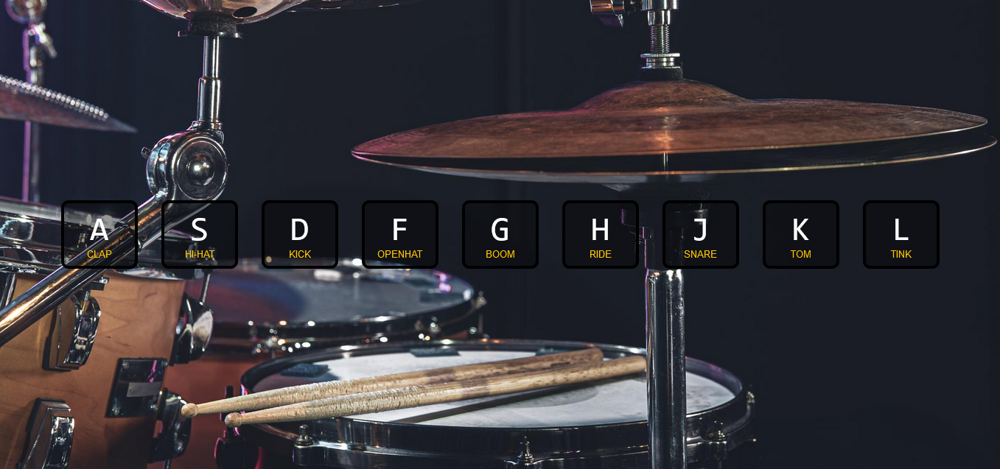

# JavaScript30 - JavaScript Drum Kit

This is the first challenge from Wes Bos's [30 Day Vanilla JS Coding Challenge](https://javascript30.com/). 

## Table of contents

- [Overview](#overview)
  - [The challenge](#the-challenge)
  - [Screenshot](#screenshot)
  - [Links](#links)
- [My process](#my-process)
  - [Built with](#built-with)
  - [What I learned](#what-i-learned)
  - [Continued development](#continued-development)
  - [Useful resources](#useful-resources)

## Overview

### The challenge

Users should be able to:

- View the optimal layout for the interface depending on their device's screen size
- Press on the keyboard the displayed keys to play the drum kit sounds.

### Screenshot

### Links

- [View Code](https://github.com/elizerdim/javascript-drum-kit)
- [Live Preview](https://elizerdim.github.io/javascript-drum-kit/)

## My process

### Built with

- Semantic HTML5 markup
- CSS
- Flexbox
- JavaScript

### What I learned

- Instead of copying everything in the tutorial or the project repository, I tried to complete the project by myself and make the code my own as much as possible. I used a different approach to sizing the boxes with Flexbox and did a few things in JavaScript code slightly differently. In the end, I feel confident about each line of code I wrote for this project.

- The keyCode property is used in the tutorial, however, my code editor (VS Code) threw an error when I used it and I found out that it was deprecated. At first, I used the 'key' property but then replaced it with 'code' property as it doesn't require any checks for lower or upper case.

- I did't use the Array.from() method to convert the nodelist into an array because my research showed that forEach() method can be used on nodelists.

- I learned how to use keydown and transitionend events.

- I learned about the currentTime property of audio/video elements.

- I used a compressed file for the background image after realizing the bigger file slowed down page load.

### Continued development

In future projects, I'd like to learn how to use other events in JavaScript and how to make this project work on touchscreen devices.

### Useful resources

- [Event reference](https://developer.mozilla.org/en-US/docs/Web/Events) - Useful event reference from MDN.
- [Optimizing images for the web](https://dev.to/prototyp/optimizing-images-for-the-web-an-in-depth-guide-4j7d) - An in-depth guide for image optimization for the web
- [Online image compressor](https://compressor.io/) - An online tool for compressing image files